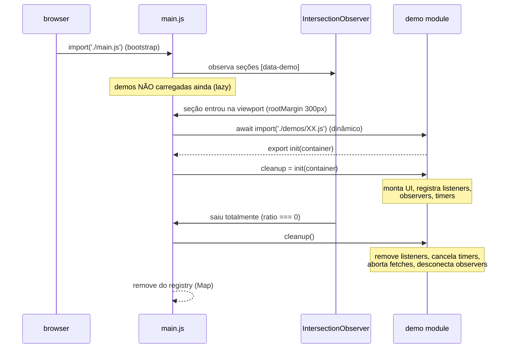

# Arquitetura — Perfect JavaScript Example

> Visão geral das dependências entre camadas, ciclo de vida de uma demo e as
> convenções de código seguidas no repositório.

## Diagrama de dependências

```mermaid
graph TD
    subgraph "Camada de entrada"
        HTML[index.html]
        MAIN[src/main.js]
    end

    subgraph "core/ — infraestrutura (sem UI)"
        DOM[dom.js]
        STORE[store.js]
        BUS[event-bus.js]
        ROUTER[router.js]
        STORAGE[storage.js]
        LOGGER[logger.js]
        I18N[i18n.js]
    end

    subgraph "utils/ — funções puras"
        DEBOUNCE[debounce.js]
        THROTTLE[throttle.js]
        MEMOIZE[memoize.js]
        COMPOSE[compose.js]
        RETRY[retry.js]
        SLEEP[sleep.js]
        CLONE[deep-clone.js]
        FORMAT[format.js]
        VALID[validators.js]
        HL[highlight.js]
    end

    subgraph "components/ — Web Components"
        PEEK[code-peek.js]
        CARD[demo-card.js]
        TOAST[toast-notification.js]
        THEME[theme-toggle.js]
        TABS[accessible-tabs.js]
    end

    subgraph "demos/ — casos de uso (lazy)"
        D01[01-closures-hof.js]
        D02[02-async-fetch.js]
        D03[..13 demos]
        D13[13-browser-apis.js]
    end

    WORKER[workers/heavy-task.worker.js]
    DATA[(data/*.json)]

    HTML --> MAIN
    MAIN -->|import() dinâmico| D01
    MAIN -->|import() dinâmico| D02
    MAIN -->|import() dinâmico| D03
    MAIN -->|import() dinâmico| D13
    MAIN --> ROUTER
    MAIN --> LOGGER
    MAIN --> DOM
    MAIN -->|aplicarTraducoes + toggle| I18N
    HTML -->|define| PEEK
    HTML -->|define| CARD
    HTML -->|define| TOAST
    HTML -->|define| THEME

    D01 --> DOM
    D01 --> COMPOSE
    D01 --> MEMOIZE
    D01 -->|tr(STRINGS, …)| I18N
    D02 --> SLEEP
    D02 --> RETRY
    D03 --> LOGGER
    D05 --> STORE
    D05 --> STORAGE
    D08 -->|postMessage| WORKER
    D09 --> DEBOUNCE
    D11 --> FORMAT
    D12 --> DEBOUNCE
    D12 --> THROTTLE
    D13 --> STORAGE
    PEEK --> HL
    PEEK -->|rótulos i18n| I18N
    CARD -->|rótulos i18n| I18N
    THEME -->|rótulos i18n| I18N
    THEME --> STORAGE
    I18N --> STORAGE
    D02 -->|fetch| DATA
    D11 -->|fetch| DATA

    classDef pura fill:#ddf4ff,stroke:#0969da
    class DEBOUNCE,THROTTLE,MEMOIZE,COMPOSE,RETRY,SLEEP,CLONE,FORMAT,VALID,HL pura
```

**Regras de dependência:**

| Camada        | Pode importar de…                           | Nunca importa…          |
| ------------- | ------------------------------------------- | ----------------------- |
| `utils/`      | nada (funções puras, zero imports internos¹ | DOM, storage, demos     |
| `core/`       | `utils/` pontualmente                       | `components/`, `demos/` |
| `components/` | `core/`, `utils/`                           | `demos/`                |
| `demos/`      | `core/`, `utils/` (nunca entre si)          | outras demos            |
| `main.js`     | tudo, via `import()` dinâmico para demos    | —                       |

¹ `sleep.js` e `highlight.js` são autocontidos; `retry.js` injeta `sleep` por
parâmetro em vez de importar, mantendo os testes sem tempo real.

**Sem dependências circulares:** a seta é sempre para baixo (demos → core/utils).
O `event-bus.js` existe justamente para desacoplar comunicação entre demos e UI
sem imports cruzados.

## Ciclo de vida de uma demo



Pontos-chave:

1. **`init(container)` é o contrato.** Toda demo exporta
   `init(container: HTMLElement): () => void`. O retorno é obrigatório — se
   `init` não devolver função, `main.js` lança `DemoLoadError` com `cause`.
2. **Cleanup sempre.** Listeners criados com `on()` guardam o handle;
   observers são desconectados; `AbortController.abort()` cancela fetches;
   `clearTimeout`/`cancelAnimationFrame` limpam timers. Sem isso, navegar entre
   seções vazaria memória.
3. **Idempotência.** O registry (`Map` em `main.js`) impede dupla carga quando
   o IntersectionObserver dispara duas vezes seguidas.
4. **Fallback sem IntersectionObserver:** tudo é carregado de uma vez (mensagens
   de status continuam válidas).

## Convenções de código

| Convenção            | Regra                                                                                                                                                                              |
| -------------------- | ---------------------------------------------------------------------------------------------------------------------------------------------------------------------------------- |
| Cabeçalho de arquivo | bloco `ARQUIVO / PROPÓSITO / CONCEITOS DEMONSTRADOS / USADO EM / COMPLEXIDADE` em pt-BR                                                                                            |
| JSDoc                | obrigatório em toda exportação (`@param`, `@returns`, `@example`, `@throws` quando aplicável)                                                                                      |
| Idioma               | UI da landing em **en-US (padrão)** com toggle **pt-BR** (`core/i18n.js`: `data-i18n*` no shell, `tr(STRINGS, …)` nas demos); comentários/JSDoc em pt-BR; identificáveis em inglês |
| Tema                 | **claro é o padrão**; `theme-toggle` cicla light → dark → system (opt-in do visitante, persistido; CSS reage via `data-tema` no `<html>`)                                          |
| Variáveis            | `const` por padrão, `let` quando reatribuída, **nunca** `var`                                                                                                                      |
| Modo estrito         | implícito nos ES Modules (`"use strict"`)                                                                                                                                          |
| DOM dinâmico         | `textContent`, `h()` ou `<template>` — **nunca** `innerHTML` com dados                                                                                                             |
| Erros                | `Error` com `cause`, tipos custom (`DemoLoadError`), feedback via `<toast-notification>`                                                                                           |
| APIs novas           | feature detection (`'x' in window`) + fallback + mensagem amigável                                                                                                                 |
| Testes               | `node:test` + `node:assert/strict`, nomes descritivos em pt-BR, timers com `mock.timers`                                                                                           |
| Estilo               | Prettier (`.prettierrc`), ESLint flat (`eslint.config.js`)                                                                                                                         |

### Padrão `h()` (hyperscript)

```js
// ✅ seguro: strings viram nós de texto, handlers via addEventListener
const li = h(
  'li.card',
  { dataset: { id }, text: item.nome },
  h('button', { on: { click: remover }, text: '✕' }),
);

// ❌ proibido: dados dinâmicos em HTML
li.innerHTML = `<span>${item.nome}</span>`;
```

### Por que `Map` no registry e `Set` nos assinantes?

`Map`/`Set` aceitam qualquer valor como chave, têm `size` O(1) e não poluem o
escopo global — os requirements proíbem variáveis globais. O estado compartilhado
vive em closures dentro de `bootstrap()`, exposto apenas via retornos de cleanup.
